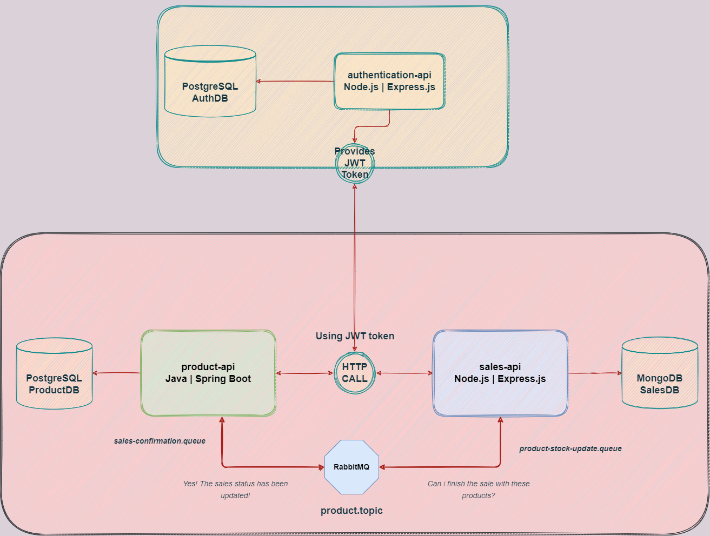

# Another repository to learn Microservices

Repository created to learn integration of microservices implemented with `Spring Boot` and `Express.js` using asynchronous communication using
`RabbitMQ` and `HTTP`.

